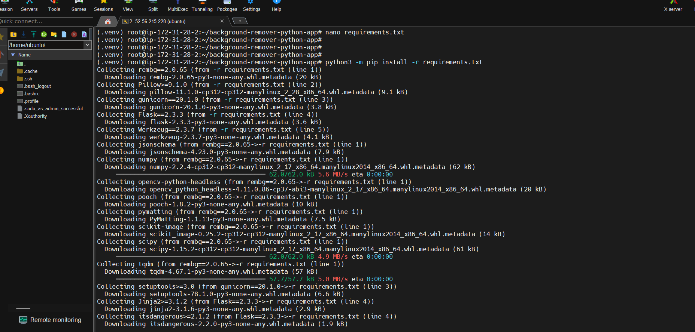

# Background Image Removal Application

This project provides a web application to remove backgrounds from images. It's based on a forked repository with adjustments made to ensure compatibility and functionality.

**Note:** This project required adjustments to the original repository's dependencies to resolve version conflicts.

## Key Changes:

* Adjusted `requirements.txt` to align with compatible versions of dependencies (specifically Flask and rembg).
* Added `onnxruntime` as a necessary dependency (installed separately due to initial `requirements.txt` conflicts).

## Installation and Setup:

The following steps outline the installation and setup process for this application on an Ubuntu environment.

1.  **Switch to Root User:**

    ```bash
    sudo -i
    ```

2.  **Update Package Lists:**

    ```bash
    apt-get update
    ```

3.  **Install Python Virtual Environment:**

    ```bash
    apt install python3.12-venv -y
    ```

    

4.  **Clone the Repository:**

    ```bash
    git clone [https://github.com/bigtheophilus/background-remover-python-app.git](https://github.com/bigtheophilus/background-remover-python-app.git)
    ```

    

5.  **Create and Activate Virtual Environment:**

    ```bash
    python3 -m venv .venv
    source .venv/bin/activate
    ```

    
    

6.  **Install pip (if not already present):**

    ```bash
    apt install pip
    ```

    

7.  **Verify pip Installation:**

    ```bash
    pip --version
    ```

    

8.  **Navigate to Application Directory:**

    ```bash
    cd background-remover-python-app/
    ```

9.  **Install Dependencies from `requirements.txt` (Initial Attempt):**

    ```bash
    python3 -m pip install -r requirements.txt
    ```

10. **View `app.py` and `requirements.txt` (for debugging/inspection):**

    ```bash
    cat app.py
    nano requirements.txt
    ```

11. **Re-install `requirements.txt` after adjustments:**

    ```bash
    python3 -m pip install -r requirements.txt
    ```

    
    

12. **Install `onnxruntime` Separately:**

    ```bash
    pip install onnxruntime
    ```

    

13. **Run the Application:**

    ```bash
    python3 app.py
    ```

    

## Issues Encountered:

* The original `requirements.txt` did not include `onnxruntime`, which is essential for the application.
* Installing `requirements.txt` as-is resulted in dependency conflicts.
* The solution was to:
    * Adjust the `requirements.txt` to compatible version.
    * Install `onnxruntime` separately using `pip`.

## Application Output:


Collapse
   
   


   
   
   
   
   
   
   
   
   
   
   
